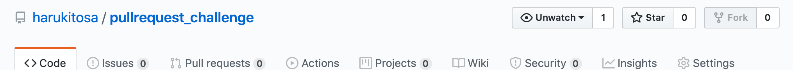
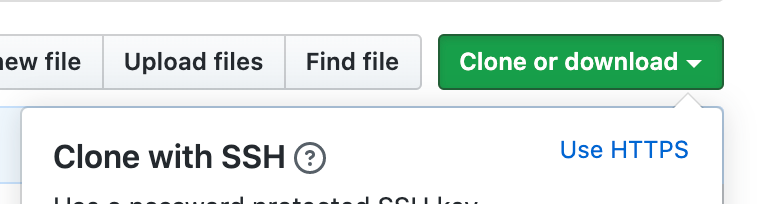

# PULLREQUEST_CHALLENGE

index.html ファイルだけのリポジトリを作成しました！
pullrequest のやり方がわからない、気軽に練習してみたい！などご要望ありましたらこのリポジトリを使用して練習してみてください！

## pullrequest のやり方(雑なので強い人ここの部分の修正プルリクまってます)



右上にある fork ボタンを押します。

自分の github のページに戻って pullrequest_challenge があるか確認する。

自分のページのclone or downloadをクリックして表示されたurlをコピる。




その後、terminnalにて

```zsh
git clone [コピーしたurl]
git checkout -b firstpullrequest # ブランチを切る、firstpullrequestの部分はなんでもいい(helloでもworldでも)
~ ファイルを編集する ~
git status # 変更したファイルを確認する
git diff # 変更内容を確認する
~ 変更内容に間違えがなければ~
git add .
git commit -m "Initial commit"
git push -u origin firstpullrequest
```

githubの自分のページのpullrequest_challengeをみにいき
プルリクエストを作成する。


## こんな説明よりわかりやすい記事

[実践] はじめてのPull Requestをやってみよう
https://qiita.com/wataryooou/items/8dce6b6d5f54ab2cef04

はじめての Pull Request
https://qiita.com/aokiplayer/items/4efb015187ed9ccc1281


## 役に立たないけど質問受け付けます

twitter
@tosa_now
